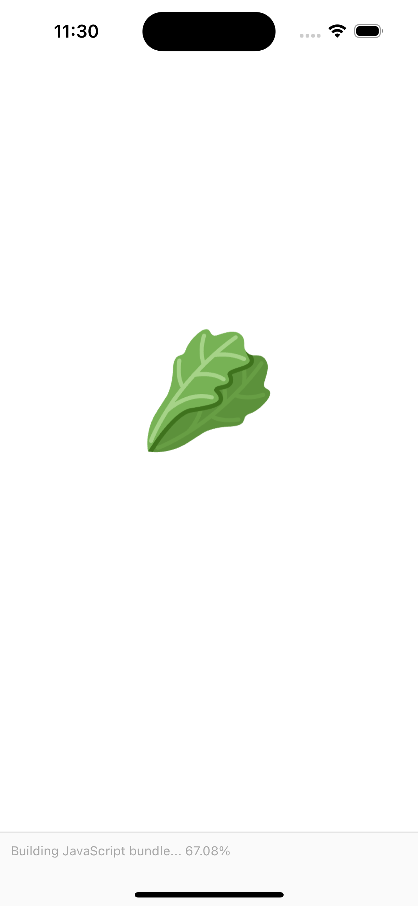
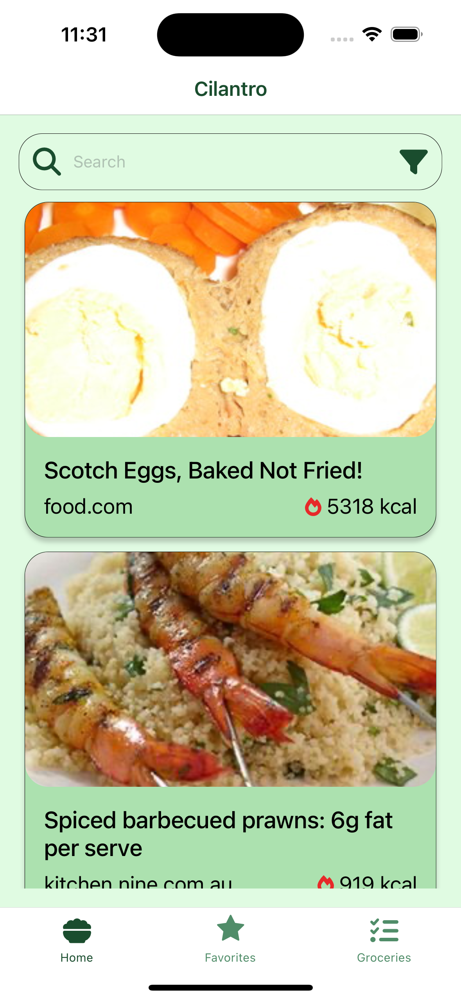
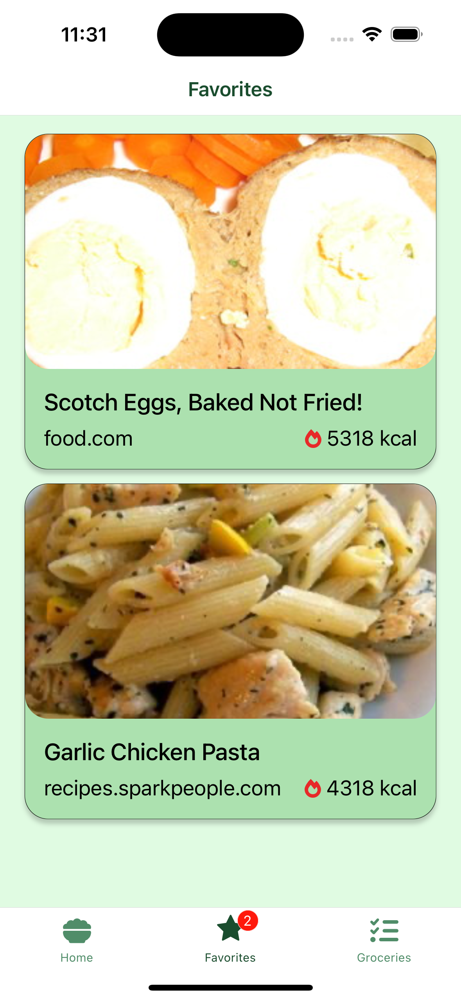
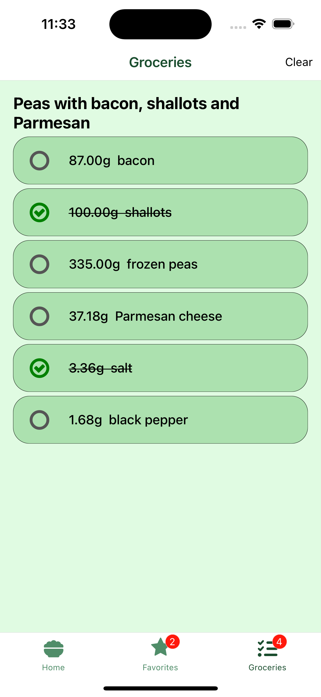
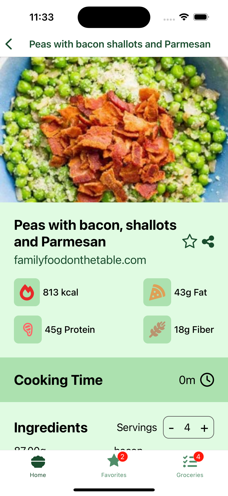

# Cilantro

Recipe app that lets you search, manage, save favorite recipes with ingredients checlist..

## Tech Stack

**Client:** React Native Expo, React Context, Tanstack Query

**Server:** EDAMAM recipes API

## Run Locally

Clone the project

```bash
  git clone <link to my repo >
```

Go to the project directory

```bash
  cd <my-project-name >
```

Install dependencies

```bash
  npm install
```

Start the server

```bash
  npm start
```

## Environment Variables

To run this project, you will need to add the following environment variables to your .env file for edamam api endpoint if you want to use your own.

`EXPO_PUBLIC_API_URL`

`EXPO_PUBLIC_API_KEY`

`EXPO_PUBLIC_APP_ID`

## Features

- Cross platform
- Real time updates with tanstack query
- Favorite and ingredients management

## Screenshots

<div>





</div>

## Documentation for dependencies

- [Expo](https://docs.expo.dev/)
- [React Native Elements](https://supabase.com/docs)
- [TanStack Query](https://tanstack.com/query/latest/docs/framework/react/overview)
- [react-native-radio-buttons-group](https://www.npmjs.com/package/react-native-radio-buttons-group)

## Roadmap

- Add local storage for offline

- Add map for nearest market to buy ingredients

## 🔗 Links

[](https://www.linkedin.com/in/bellkim-keith-onggon-0b6467140/)
